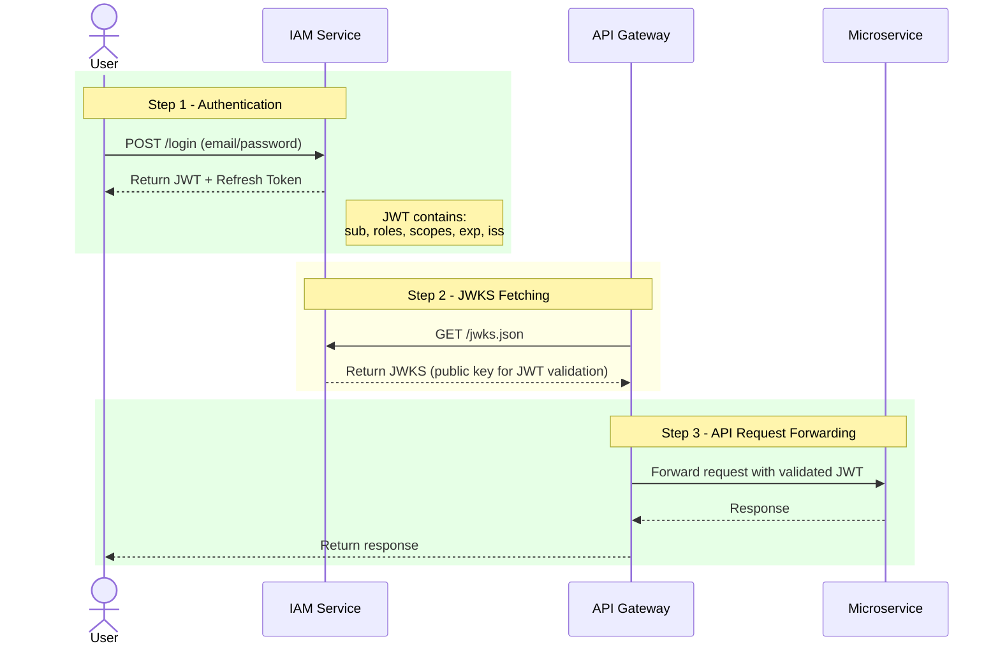

# amcloud-iam

## Description
amcloud-iam is the Identity and Access Management (IAM) microservice for the amcloud-platform ecosystem.  
It handles authentication, authorization, and user management, enabling secure access control across microservices.

## Prerequisites

- Java JDK 17 or higher
- Maven 3.9+
- PostgreSQL (default database service) must be running and correctly configured
- [Optional] Docker (for deployment)
- Git

## Repository Structure

```
amcloud-iam/
├── backend/                      # Main Spring Boot IAM source code
│   ├── src/
│   │   ├── main/
│   │   │   ├── java/cm/amcloud/platform/iam/
│   │   │   │   ├── config/       # Configuration classes (e.g., JWT, database)
│   │   │   │   ├── service/      # Business logic and service layer
│   │   │   │   ├── controller/   # REST API controllers
│   │   │   │   ├── repository/   # Data access layer (JPA repositories)
│   │   │   │   ├── dto/          # Data Transfer Objects
│   │   │   │   ├── model/        # Entity classes (database models)
│   │   │   ├── resources/        # Application resources (e.g., .env, keys, SQL scripts)
│   │   │   │   ├── keys/         # Public and private keys for JWT
│   │   │   │   ├── schema.sql    # Database schema
│   │   │   │   ├── data.sql      # Initial data for the database
│   │   │   │   ├── application.yml # Spring Boot configuration
│   │   │   │   ├── application.properties # Additional properties
│   │   ├── test/                 # Unit and integration tests
│   ├── pom.xml                   # Maven configuration file
│   ├── Dockerfile                # Docker configuration for the IAM service
│   ├── mvnw                      # Maven wrapper script (Linux/Mac)
│   ├── mvnw.cmd                  # Maven wrapper script (Windows)
│   ├── .mvn/                     # Maven wrapper configuration
│   ├── .gitignore                # Git ignore file
│   ├── LICENSE                   # License file
│   ├── README.md                 # Project overview and instructions
├── .github/                      # GitHub workflows, issue templates, etc.
├── docs/                         # Documentation and diagrams
└── README.md
```

## Environment Configuration

A `.env` file **must** be present at the root of `backend/` before running or testing the microservice.  
Example content:

```
# Environment variables for the IAM service
JWT_PRIVATE_KEY_PATH=classpath:keys/private.pem
JWT_PUBLIC_KEY_PATH=classpath:keys/public.pem
JWT_EXPIRATION_TIME=3600
JWT_KEY_ID=my-key-id
IAM_SERVER_PORT=8081
ISSUER_URI=http://localhost:8081

# === Database config
MAIN_DB_URL=jdbc:postgresql://localhost:5432/amcloud_iam_db
MAIN_DB_USERNAME=amcloud_admin
MAIN_DB_PASSWORD=amcloud_pass
MAIN_DB_DRIVER_CLASS_NAME=org.postgresql.Driver
JPA_DATABASE_PLATFORM=org.hibernate.dialect.PostgreSQLDialect
SQL_INIT_MODE=always
JPA_HIBERNATE_DDL_AUTO=update
#CONFIG_SERVER_URL=http://localhost:8888
```

> ⚠️ **Never commit sensitive values (tokens, passwords) into the repository.**  
> Use placeholders and configure secrets securely in your deployment environments.

## Installation & Build

```bash
git clone https://github.com/Project-In3-Uds/amcloud-iam.git
cd amcloud-iam/backend
mvn clean install
```

## Running the Microservice

You can start the IAM server with:

```bash
mvn spring-boot:run
```

Or build the JAR and run:

```bash
mvn package
java -jar target/iam-0.0.1-SNAPSHOT.jar
```

## Basic API Usage

By default, the IAM server runs on `http://localhost:8081/`.

To authenticate a user:
```bash
curl -X POST http://localhost:8081/auth/login -d '{"username":"admin","password":"adminpass"}' -H "Content-Type: application/json"
```
Or use the existing iam-test.http rest client file.

To fetch JWKS for JWT validation:
```bash
curl http://localhost:8081/jwks.json
```

To fetch OpenID Connect configuration
```bash
curl http://localhost:8081/.well-known/openid-configuration
```
## Technologies Used

- Java 17
- Spring Boot 3.x (IAM)
- Maven
- Docker (optional)
- PostgreSQL (Database)
- GitHub Actions (CI/CD)

## Architecture Overview

Below is a simplified diagram showing how the IAM microservice handles authentication and integrates with other microservices:



## Known Issues / Limitations

- Requires a database for user and role management.
- No rate-limiting or advanced security features by default (consider adding these in production).
- Hot-reloading of user roles and permissions is dependent on client microservice capabilities.

## Support / Contact

- For questions or support, [open an issue](https://github.com/Project-In3-Uds/amcloud-iam/issues).
- For real-time discussion, contact us at project.in3.uds@outlook.com.

## Contribution

We welcome contributions! Please read our [CONTRIBUTING.md](CONTRIBUTING.md) and [CODE_OF_CONDUCT.md](CODE_OF_CONDUCT.md) before submitting a pull request.

## License

This project is licensed under the Apache License 2.0. See the [LICENSE](LICENSE) file for details.

## Credits

Developed by Project-In3-Uds contributors.  
Special thanks to all open-source libraries and the community!
